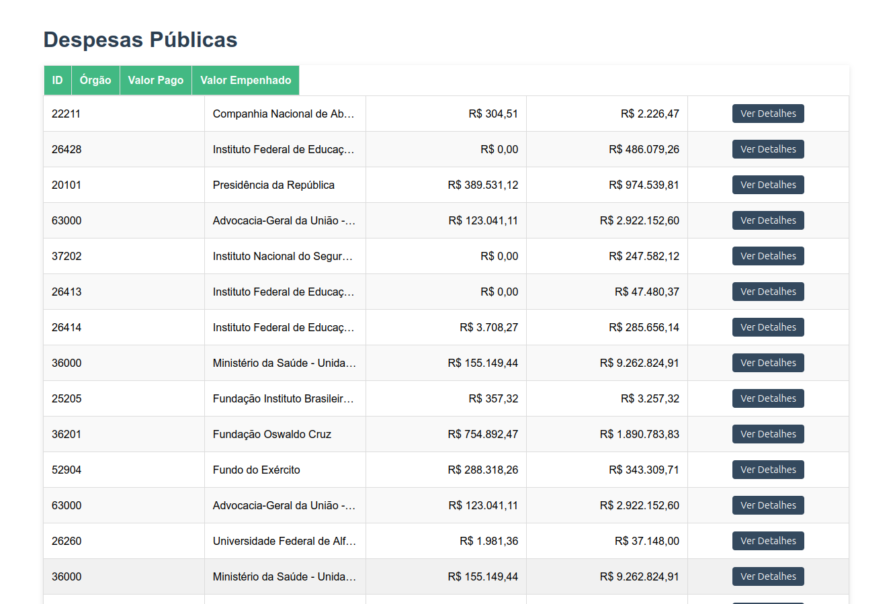
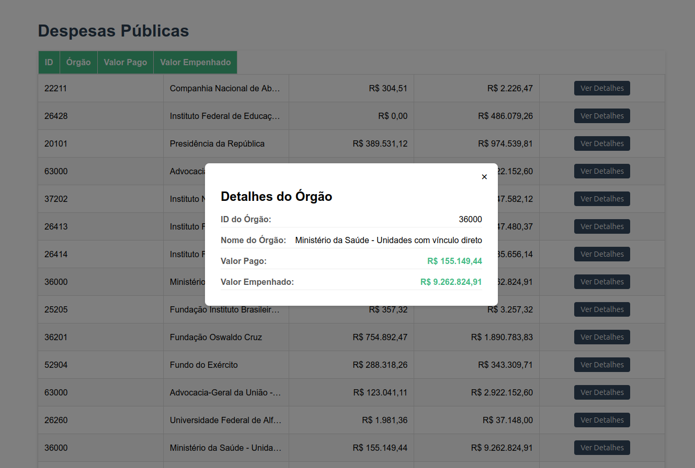

# GovSpend Analytics

## Status do Projeto

**Tracer Bullet 1: Concluída** ✅
Este projeto utiliza a abordagem "Tracer Bullet" (Projétil Rastreador) para validar a arquitetura de ponta a ponta: desde a extração de dados brutos de gastos públicos até a exibição em uma interface moderna. O objetivo desta etapa foi estabelecer o pipeline completo: ETL -> Banco de Dados (Star Schema) -> API -> Frontend.

## Funcionalidades Implementadas

*   **Pipeline ETL:** Processamento de arquivos ZIP/CSV de despesas públicas, com limpeza e transformação de dados usando Pandas.
*   **Modelagem Star Schema:** Implementação de tabelas de Fato (`fato_despesas`) e Dimensão (`dim_orgao_public`) no PostgreSQL.
*   **Backend API:** Endpoints FastAPI que realizam JOINs complexos para entregar dados detalhados por órgão.
*   **Frontend Vue.js:** Interface responsiva com listagem de despesas e um sistema de modal para detalhes individuais.
*   **Containerização:** Banco de dados PostgreSQL configurado via Docker Compose.

# Preview




## Tecnologias Utilizadas

*   **Backend:** Python 3.x, FastAPI, SQLModel (SQLAlchemy), Pandas, Psycopg2.
*   **Banco de Dados:** PostgreSQL 15, Docker.
*   **Frontend:** Vue 3 (Vite), Axios, CSS Moderno.
*   **Processamento de Dados:** ETL customizado para dados do Portal da Transparência.

## Pré-requisitos

*   Python 3.10+
*   Node.js (npm)
*   Docker e Docker Compose
*   Arquivo de dados `202601_Despesas.zip` na pasta `/data`

## Como Executar

O projeto requer a execução coordenada do banco, carga de dados e servidores.

### 1. Banco de Dados (Docker)
Inicie o container do PostgreSQL:
```bash
docker-compose up -d
```

### 2. Configuração e ETL (Backend)
Crie um arquivo `.env` na raiz com suas credenciais (DB_USER, DB_PASSWORD, DB_NAME). Em seguida:
```bash
# Instale as dependências
pip install -r requirements.txt

# Crie as tabelas no banco
python ativa_queries.py

# Execute o pipeline de carga de dados
python etl.py

# Inicie a API
uvicorn api:app --reload
```
A API estará disponível em `http://localhost:8000`.

### 3. Frontend (Vue.js)
Em um novo terminal:
```bash
cd frontend
npm install
npm run dev
```
A aplicação iniciará em `http://localhost:5173`.

## Estrutura de Pastas (Simplificada)

*   `api.py`: Definição dos modelos SQLModel e endpoints da API.
*   `etl.py`: Lógica de extração, transformação (limpeza de valores zerados) e carga (Truncate/Insert).
*   `ativa_queries.py`: Script de automação para criação do schema SQL.
*   `queries.sql`: Definição DDL das tabelas e índices.
*   `frontend/src/components/`: Componentes Vue (`DespesasList.vue` e `DespesaDetail.vue`).

## Endpoints da API

`GET /despesas/`

Retorna a lista agregada de despesas por órgão.
**Exemplo de Resposta:**
```json
[
  {
    "id_orgao": 26439,
    "nome_orgao": "Instituto Federal do Sertão Pernambucano",
    "valor_pago": 1500450.75,
    "valor_empenhado": 1850000.00
  }
]
```
`GET /despesas/{id_orgao}`

Retorna os detalhes específicos de um órgão.

## Próximos Passos (Roadmap)

*   **Dashboard Visual:** Adicionar gráficos de pizza para distribuição de gastos por órgão superior.
*   **Filtros Avançados:** Implementar busca por nome do órgão e filtros por faixa de valores no backend.
*   **Paginação:** Otimizar a listagem para suportar milhares de registros.
*   **Testes Automatizados:** Implementar Pytest para o ETL e Vitest para os componentes Vue.
